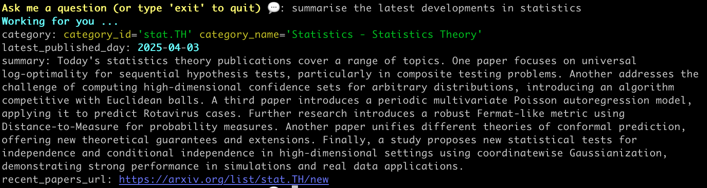
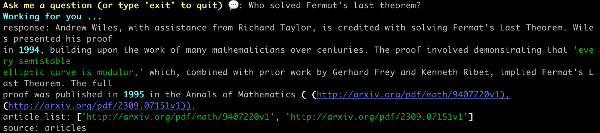
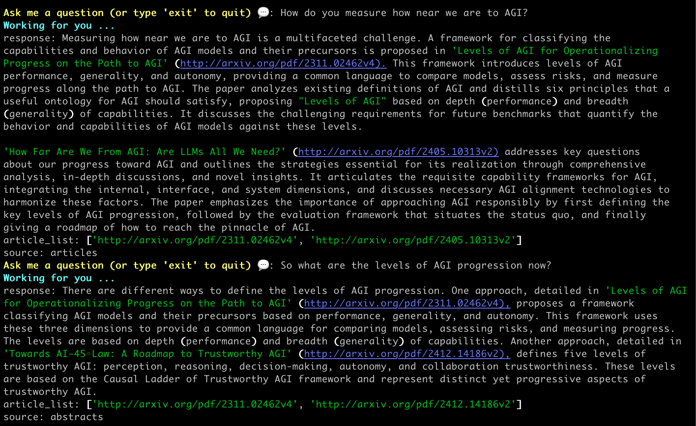
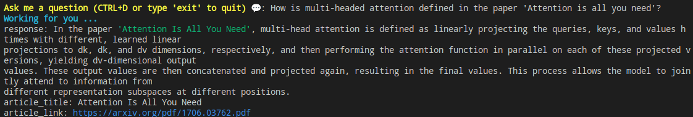
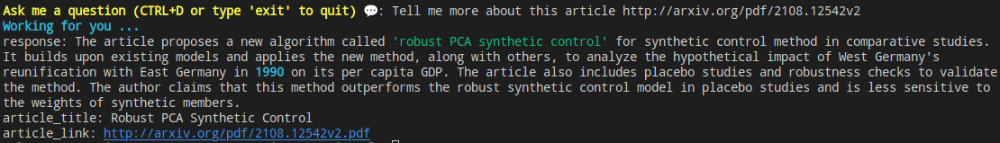
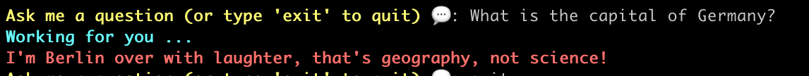

<p align="center"></p>
<h1 align="center">
Askademic


[](https://deepwiki.com/martinapugliese/askademic)
</h1>

# What is this

_Tip: you can use [DeepWiki](https://deepwiki.com/martinapugliese/askademic) to see details and ask questions about this!_

Askademic is an AI agent, working as a CLI tool, that helps you with finding information in research papers, so long as they are on **arXiv**. It queries the arXiv API and can:
* summarise the latest papers in a category
* answer questions, searching first for relevant papers
* retrieve info about a specific paper, by link or title
* handle flexible academic requests that don't fit the standard categories

You can also ask follow-up questions. And, it has an eye for things non-scientific... see below.

As for everything that uses LLM, **check your outputs** - it can make mistakes.

As its underlying LLM, you can choose to run it either with:
* Gemini (it will use 2.0 Flash) [preferred and default option]
* Claude (it will use Haiku 4.5) [experimental]
* Claude via AWS Bedrock (it will use Haiku 4.5) [experimental]
* Nova Pro via AWS Bedrock [experimental]

Gemini is preferred because:
* it has a free tier - we privilege cost-effectiveness over speed, which means for short conversations you should be within the quotas of the free tier
* it has a very large context window - this allows to manage the input when many papers are retrieved much more comfortably (note: it is known that )
Claude is experimental because of rate limits and input context limitations. You may see errors for limits exceeded/too many requests etc. There are mechanisms whereby askademic retries, but let us know if something really is off, we're working on improving this.

## Important note about the paper-reading feature

The agent reads the paper via pulling the whole text from arXiv, there isn't an API endpoint giving whole text so this is done via the site. This feature is meant to be used lightly, that is, not reading too many papers at short turnarounds, because this would violates arXiv's terms of use.

To minimize API load, Askademic includes a caching system that saves previously fetched papers for 7 days. This helps reduce the number of requests to arXiv and improves response times for papers you've already accessed.

# Requirements

Works with Python 3.11 and above.

# Installation & setup

1. Clone this repo
2. `cd` into it and pip install it as `pip install .` Alternatively, you can `pip install` from the GitHub link. Or, use `uv` with `uv tool install --python python3.11 .` — this lets you choose the exact Python version for your environment, which is useful for testing or compatibility.
3. Then, you need a Gemini API key. Head to [Google AI Studio](https://aistudio.google.com/app/apikey) to generate it
4. Set the environment variables needed by copying the .env-template file to a .env file and filling in, the necessary ones are the `LLM_FAMILY` and the related API key.

**Note**: the first time you run it after you've set up the .env file it will take a few seconds to boot up everything. Thereafter it should be faster.

# Run it

Run it with command `askademic` from the terminal.

# Examples of what it can do

### When you ask for a summary of latest papers




### When you ask questions - with and without follow-up






### When you ask a question or details about a specific article





### When you ask something non-scientific, you deserve a pun!



# Roadmap and issues

Please try it and give us feedback! If you find quirks or something that is not great, or if you just would like to see other features, please open an issue! Describe it clearly. You can see what we're working on in the [kanban board](https://github.com/users/martinapugliese/projects/1/views/1).

# Evals

At the moment, we run them manually every time we ship a PR. They're a handful of simple checks and are run as
```
python evals.py
```
from within the `evals/` folder. If you have suggestions we'd love to hear.

# Acknowledgments

* Thank you to [arXiv](https://arxiv.org/) for use of its open access interoperability. This [service/ product] was not reviewed or approved by, nor does it necessarily express or reflect the policies or opinions of, arXiv.
* Logo: GPT4o
* Askademic is built on [PydanticAI](https://ai.pydantic.dev/).

# Licence

2025 - GNU General Pubic License v3
