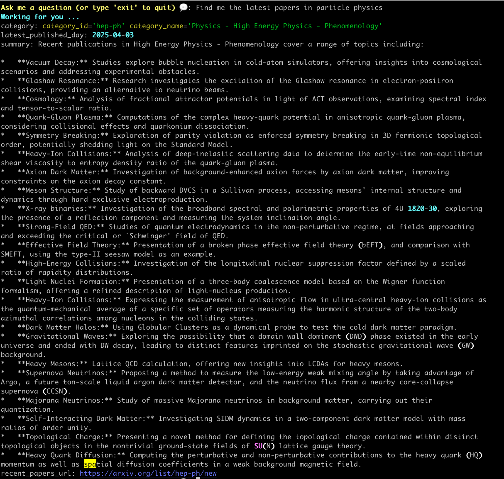

# Askademic

Askademic is an AI agent that helps you with finding information in research papers. It queries the arXiv API and can:
* summarise the latest papers in a category/subcategory for you
* answer questions by retrieving relevant papers and searching within them to produce an answer
It also allows you to have a conversation, that is, to ask for follow-up questions.

It works as a CLI tool.

Askademic uses Google Gemini 2.0 as its underlying LLM. We aim to expand it to allow for multiple LLMs in the (near) future, especially open ones, but this early choice has been motivated by some factors:
* it has a free tier - we wrote the agent in such a way to privilege cost-effectiveness over speed, which means for short conversations you should be within the quotas of the free tier
* it has a very large context window, very useful for questions where extensive searches over many papers are needed
* it works pretty well for this use cases

Askademic is built on [PydanticAI](https://ai.pydantic.dev/) as its agents framework.

## Requirements

Works with Python 3.11 and above.

## Installation & setup

This release is a beta and askademic has not been published on PyPI _yet_.

1. Clone this repo
2. `cd` into it and pip install it as `pip install .`
Alternatively, you can pip install from the GitHub link.

3. Then, you need a Gemini API key. Head to [Google AI Studio](https://aistudio.google.com/app/apikey) to generate it and run

```
export GEMINI_API_KEY=your-api-key
```

## Run it

You just run it with command `askademic` from the terminal.

### Examples

Open the toggles for some screenshots of what you get as

<details>
<summary>When you ask for a summary of latest papers</summary>

</details>

## Acknowledgments

Thank you to arXiv for use of its open access interoperability. This [service/ product] was not reviewed or approved by, nor does it necessarily express or reflect the policies or opinions of, arXiv.

## Licence

2025 - GNU General Pubic License v3
